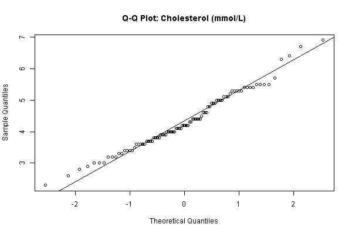

## Key findings (draft)
Add bullet points as you go.

## Figures

### Q-Q Plots

<details>
<summary>Select a plot</summary>

<div>
  <label for="qq-select">Variable:</label>
  <select id="qq-select" aria-label="Select Q-Q plot">
    <option value="Cholesterol">Cholesterol</option>
    <option value="HDL Cholesterol">HDL Cholesterol</option>
    <option value="HEI-FLEX">HEI-FLEX</option>
    <option value="Homocysteine">Homocysteine</option>
    <option value="LDL Cholesterol">LDL Cholesterol</option>
    <option value="Pulse Wave Velocity">Pulse Wave Velocity</option>
    <option value="Triglycerides">Triglycerides</option>
  </select>
</div>

<div id="qq-container" style="margin-top:1rem;">
  
  <p id="qq-caption">Appears normally distributed</p>
</div>

<script>
  const qqMap = {
    "Cholesterol": {
      src: "figures/Cholesterol..mmol.L._qqplot.png",
      caption: "Appears normally distributed",
    },
    "HDL Cholesterol": {
      src: "figures/HDL_cholesterol..mmol.L._qqplot.png",
      caption: "Appears normally distributed",
    },
    "HEI-FLEX": {
      src: "figures/HEI-FLEX_qqplot.png",
      caption: "Appears normally distributed",
    },
    "Homocysteine": {
      src: "figures/Homocystein..µmol.L._qqplot.png",
      caption: "Appears right skewed",
    },
    "LDL Cholesterol": {
      src: "figures/LDL_cholesterol..mmol.L._qqplot.png",
      caption: "Appears normally distributed",
    },
    "Pulse Wave Velocity": {
      src: "figures/Pulse_wave_velocity_qqplot.png",
      caption: "Appears normally distributed, with one outlier",
    },
    "Triglycerides": {
      src: "figures/Triglycerides..mmol.L._qqplot.png",
      caption: "Appears right skewed",
    },
  };

  const select = document.getElementById('qq-select');
  const img = document.getElementById('qq-img');
  const caption = document.getElementById('qq-caption');

  select.addEventListener('change', (event) => {
    const choice = event.target.value;
    const data = qqMap[choice];
    if (data) {
      img.src = data.src;
      img.alt = `${choice} Q-Q plot`;
      caption.textContent = data.caption;
    }
  });
</script>

</details>

```{r}
# If using R, put code here (optional)

# If using Python, put code here (optional)

