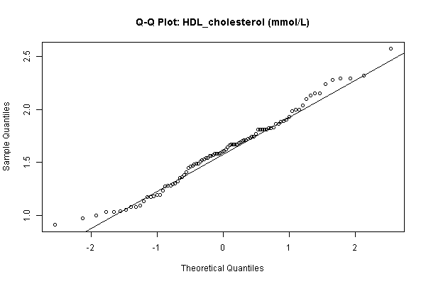
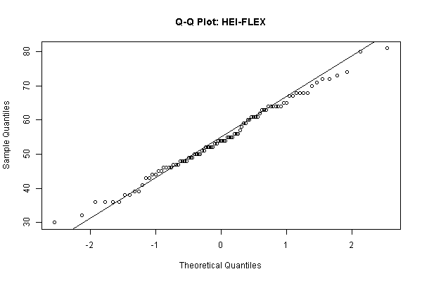
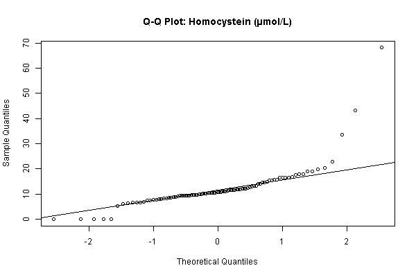
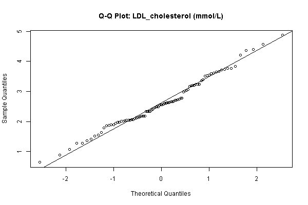
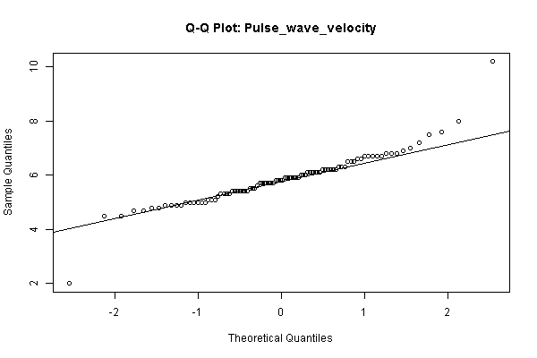
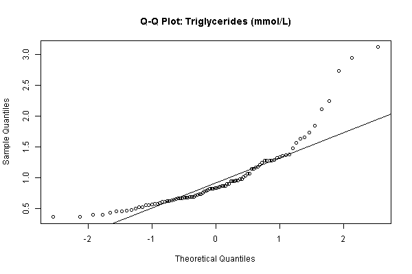

## Key findings (draft)
Add bullet points as you go.

## Figures

::: details
### Q-Q Plots

- 
Appears normally distributed
- 
Appears normally distributed
- 
Appears normally distributed
- 
Appears right skewed
- 
Appears normally distributed
- 
Appears normally distributed, with one outlier
- 
Appears right skewed

:::

```{r}
# If using R, put code here (optional)

# If using Python, put code here (optional)

